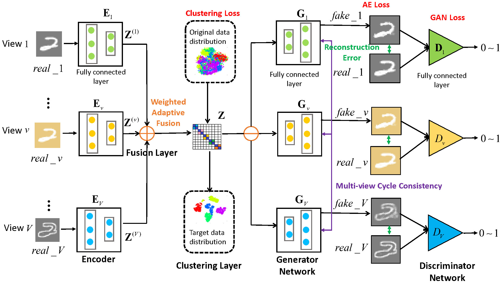

#GP-MVC: Generative Partial Multi-View Clustering with Adaptive Fusion and Cycle Consistency#

***

This repo contains the source code and dataset for our TIP 2021 paper:

**Qianqian Wang**, Zhengming Ding, Zhiqiang Tao, Quanxue Gao, Yun Fu, Generative Partial Multi-View Clustering with Adaptive Fusion and Cycle Consistency, IEEE Transactions on Image Processing, 2021.

[Paper Link](https://arxiv.org/abs/2003.13088)

Bibtex

@article{Wang2021gpmvc,
  title={ Generative Partial Multi-View Clustering with Adaptive Fusion and Cycle Consistency },  
  author={Wang, Qianqian and Ding, Zhengming and Tao, Zhiqiang and Gao, Quanxue and Fu, Yun},  
  journal={ IEEE Transactions on Image Processing },  
  volume={99},  
  number={9},  
  pages={1-11},  
  year={2021},  
}

This paper is an extension to our previous work: 

[Qianqian Wang, Zengming Ding, Zhiqiang Tao, Quanxue Gao and Yun Fu, Partial Multi-view Clustering via Consistent GAN, IEEE ICDM, 2018: 1290-1295.](https://ieeexplore.ieee.org/abstract/document/8594983/)

**GP-MVC Model:**

<div style="text-align: center; width: 900px; border: green solid 1px;">

<br></br>
<center>Figure 1: Network Model</center>
</div>


**Introduction**

Nowadays, with the rapid development of data collection sources and feature extraction methods, multi-view data are getting easy to obtain and have received increasing research attention in recent years, among which, multi-view clustering (MVC) forms a mainstream research direction and is widely used in data analysis. However, existing MVC methods mainly assume that each sample appears in all the views, without considering the incomplete view case due to data corruption, sensor failure, equipment malfunction, etc. In this study, we design and build a generative partial multi-view clustering model with adaptive fusion and cycle consistency, named as GP-MVC, to solve the incomplete multi-view problem by explicitly generating the data of missing views. The main idea of GP-MVC lies in two-fold. First, multi-view encoder networks are trained to learn common low-dimensional representations, followed by a clustering layer to capture the shared cluster structure across multiple views.  Second, view-specific generative adversarial networks with multi-view cycle consistency are developed to generate the missing data of one view conditioning on the shared representation given by other views. These two steps could be promoted mutually, where the learned common representation facilitates data imputation and the generated data could further explore the view consistency. Moreover, a weighted adaptive fusion scheme is implemented to exploit the complementary information among different views. Experimental results on four benchmark datasets are provided to show the effectiveness of the proposed GP-MVC over the state-of-the-art methods.

<div style="text-align: center; width: 900px; border: green solid 1px;">

<br></br>
<center>Figure 2: Illustration of partial multi-view data with image and text views</center>
</div>

<div style="text-align: center; width: 900px; border: green solid 1px;">

<br></br>
<center>Figure 3: Illustration for multi-view data</center>
</div>

<div style="text-align: center; width: 900px; border: green solid 1px;">

<br></br>
<center>Figure 4: The framework of cycle GAN</center>
</div>


**Dataset:**

HW (Handwritten numerals): an image dataset with 2,000 images of 10 classes from 0 to 9 digit. Each class contains 200 samples with 6 kinds of features, i.e., 76 Fourier coefficients for two-dimensional shape descriptors (FOU), 216 profile correlations (FAC), 64 Karhunen-Loeve coefficients (KAR), 240-pixel feature (PIX) obtained by dividing the image of 30*48 pixels into 240 tiles of 2*3 pixels and counting the average number of object pixels in each tile, 47 rotational invariant Zernike moment (ZER), and 6 morphological (MOR) features. 
In our experiment, we choose the first three views of HW dataset: 76 Fourier coefficients for two-dimensional shape descriptors (FOU), 216 profile correlations (FAC), 64 Karhunen-Loeve coefficients (KAR).

**Requirements**  
Python 3.6  
PyTorch 1.0  
**Train the model**  
<!--
<table><tr><td bgcolor=Gainsboro	 width="900">python train.py  </td></tr></table>  
-->
```
python train.py
``` 

**Experimental Results**  
<div style="text-align: center; width: 900px; border: green solid 1px;">

<br></br>
<center>Figure 5: Esperimental Result</center>
</div>

**Acknowledgments**

Code is inspired by [VIGAN](https://github.com/chaoshangcs/VIGAN) [CycleGAN](https://github.com/chaoshangcs/pytorch-CycleGAN-and-pix2pix).


